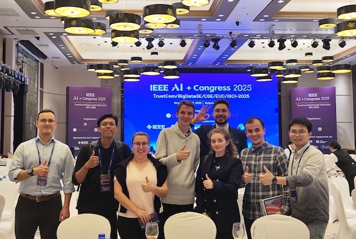
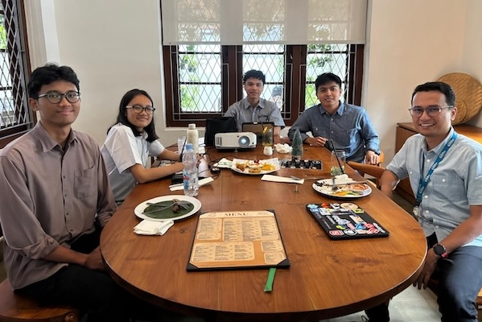
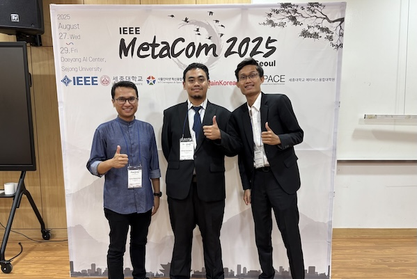
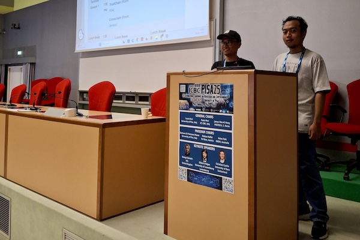
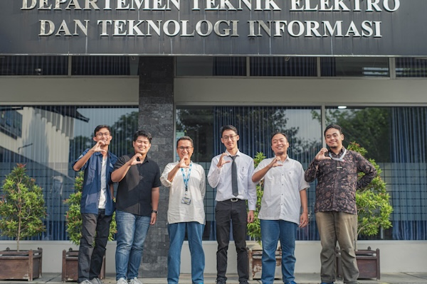
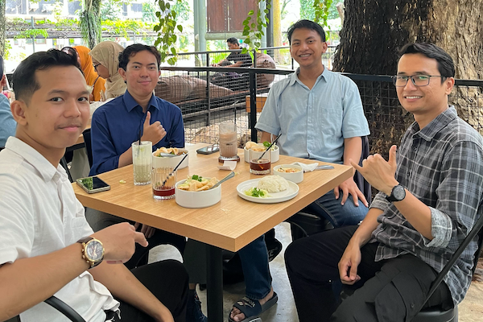

I have been privileged to collaborate with highly motivated students and colleagues, enabling us to conduct quality research together.

	
	

        
        
		
		
		
		
	

	<button class="nav-btn prev" aria-label="Previous">‹</button>
	<button class="nav-btn next" aria-label="Next">›</button>
	

		
		
		
        
        
        
	

	

	

## Research Associate

**Muhammad Shidiq** - <a href="https://www.linkedin.com/in/shidiq-muhammad-72972140/" target="_blank"><i class="fab fa-linkedin"></i></a>  
_Research associate in climate and energy modeling._

## Master's Students

**Maulidi Adi Prasetia** - <a href="https://id.linkedin.com/in/maulidi-adi" target="_blank"><i class="fab fa-linkedin"></i></a>  
_Topic: multi-modal privacy preserving federated learning for mobile edge computing._

**Rahmat Ismoyo Putro** - <a href="#" target="_blank"><i class="fab fa-linkedin"></i></a>  
_Topic: anomaly detection in AMR data with machine learning (PLN)._

**Godwin Amoako Atta** - <a href="https://gh.linkedin.com/in/godwin-amoako-atta-a0083699" target="_blank"><i class="fab fa-linkedin"></i></a>  
_Topic: decentralized identities for secure communication._

**Muhammad Hilya S D Yasin** - <a href="https://www.linkedin.com/in/muhammad-hilya-surya-dilaga-yasin-533a92210/" target="_blank"><i class="fab fa-linkedin"></i></a>  
_Topic: Decentralized Physical Infrastructure Network (DePIN)._

## Bachelor's Students

**Fidelya Fredelina** - <a href="https://www.linkedin.com/in/fidelya-fredelina/" target="_blank"><i class="fab fa-linkedin"></i></a>  
_Undergraduate research project._

**Deren Tanaphan** - <a href="https://www.linkedin.com/in/derentanaphan/" target="_blank"><i class="fab fa-linkedin"></i></a>  
_Undergraduate research project._

**Adzka Bagus** - <a href="https://www.linkedin.com/in/adzka-bagus/" target="_blank"><i class="fab fa-linkedin"></i></a>  
_Undergraduate research project._

**Muhammad Grandiv Lava Putra** - <a href="https://www.linkedin.com/in/muhammad-grandiv-lava-putra-364b0324b/" target="_blank"><i class="fab fa-linkedin"></i></a>  
_Undergraduate research project._

## Research and Teaching Assistant

**Muhammad Khoirunas** - <a href="https://www.linkedin.com/in/khoirunas/" target="_blank"><i class="fab fa-linkedin"></i></a>  
_Current projects and research support._

**Theo Sanyoto** - <a href="https://www.linkedin.com/in/theo-immanuel-sanyoto-680b73327/" target="_blank"><i class="fab fa-linkedin"></i></a>  
_Teaching and project assistant._

## Past Members
Postgraduate
- Dimas Arief Rahman Kurniawan - <a href="https://www.linkedin.com/in/dimasark/" target="_blank"><i class="fab fa-linkedin"></i></a>  

Undergraduate

- Bintang Restu Bawono - <a href="https://www.linkedin.com/in/bintangrestubawono/" target="_blank"><i class="fab fa-linkedin"></i></a>  
- Bagus Rakadyanto Oktavianto Putra - <a href="https://id.linkedin.com/in/bagus-rakadyanto-oktavianto-putra-0b0839221" target="_blank"><i class="fab fa-linkedin"></i></a>  
- Aufa Nasywa Rahman - <a href="https://id.linkedin.com/in/aufarahman" target="_blank"><i class="fab fa-linkedin"></i></a>  
- Franciscus Marselino Handoyo - <a href="https://id.linkedin.com/in/franciscus-marselino-handoyo-790822220" target="_blank"><i class="fab fa-linkedin"></i></a>  
- Ahmad Zaki Akmal - <a href="https://id.linkedin.com/in/ahmad-zaki-akmal" target="_blank"><i class="fab fa-linkedin"></i></a>  

Short-term Project

- Polikarpus Arya Pradhanika - <a href="https://www.linkedin.com/in/polikarpus-arya-pradhanika/" target="_blank"><i class="fab fa-linkedin"></i></a>  
- Muhammad Muqtada Alhaddad - <a href="https://www.linkedin.com/in/muhammad-muqtada-alhaddad-b02b44195/" target="_blank"><i class="fab fa-linkedin"></i></a>  
- Muhammad Fathan Zahir - <a href="https://www.linkedin.com/in/muhammadfathanzahir/" target="_blank"><i class="fab fa-linkedin"></i></a>  
- Muchammad Daniyal Kautsar - <a href="https://www.linkedin.com/in/mdaniyalk/" target="_blank"><i class="fab fa-linkedin"></i></a>  
- Mochammad Novaldy Pratama Hakim - <a href="https://www.linkedin.com/in/novaldyph/" target="_blank"><i class="fab fa-linkedin"></i></a>  
- Maulana Anjari Anggorokasih - <a href="https://www.linkedin.com/in/maulana-anjari-anggorokasih/" target="_blank"><i class="fab fa-linkedin"></i></a>  
