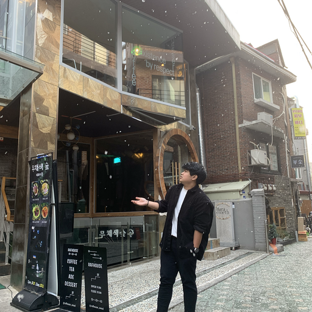

I have been privileged to collaborate with highly motivated students and colleagues, enabling us to conduct cutting-edge research together.

Research Associate
------------------

    

          
        <a href="https://www.linkedin.com/in/shidiq-muhammad-72972140/" target="_blank">Muhammad Shidiq</a>  
        Research associate in climate and energy modeling.
    

Master's Students
-----------------

    

          
        <a href="#" target="_blank">Dimas Arief Rahman Kurniawan</a>  
        Topic: multi-modal AI assistant for billing management (PLN).
    

    

          
        <a href="https://id.linkedin.com/in/maulidi-adi" target="_blank">Maulidi Adi Prasetia</a>  
        Topic: multi-modal privacy preserving federated learning for mobile edge computing.
    

    

          
        <a href="#" target="_blank">Rahmat Ismoyo Putro</a>  
        Topic: anomaly detection in AMR data with machine learning (PLN).
    

Bachelor's Students
-------------------

    

          
        <a href="https://www.linkedin.com/in/bintangrestubawono/" target="_blank">Bintang Restu Bawono</a>  
        Topic: federated learning for financial services.
    

    

          
        <a href="https://id.linkedin.com/in/bagus-rakadyanto-oktavianto-putra-0b0839221" target="_blank">Bagus Rakadyanto Oktavianto Putra</a>  
        Topic: llm for cybersecurity.
    

    

          
        <a href="https://id.linkedin.com/in/aufarahman" target="_blank">Aufa Nasywa Rahman</a>  
        Topic: trusted data layer as a service in data-intensive applications.
    

    

          
        <a href="https://id.linkedin.com/in/franciscus-marselino-handoyo-790822220" target="_blank">Franciscus Marselino Handoyo</a>  
        Topic: air quality monitoring and modeling.
    

    

          
        <a href="https://id.linkedin.com/in/ahmad-zaki-akmal" target="_blank">Ahmad Zaki Akmal</a>  
        Topic: fault tolerant web services using blockchain.
    

<!-- 

    

          
        <a href="https://www.linkedin.com/in/mufidussani/" target="_blank">Mufidus Sani</a>  
        Topic: decentralized emission trading system.
    

    

          
        <a href="https://www.linkedin.com/in/adyasena/" target="_blank">Adya Sena Pamungkas</a>  
        Topic: blockchain-based Domain Name System.
    

    

      
    <a href="https://www.linkedin.com/in/christianale/" target="_blank">Christian Ale Perdana</a>  
    Topic: interoperability of self-sovereign identities.
    

 -->

Research Asistant
-----------------

    

      
    <a href="https://id.linkedin.com/in/bagus-rakadyanto-oktavianto-putra-0b0839221" target="_blank">Bagus Rakadyanto Oktavianto Putra</a>  
    Project: endorsement-driven ssi for iot.
    

<!-- 

    

          
        <a href="#" target="_blank">Mochammad Novaldy Pratama Hakim</a>  
        Project: interoperability in siloed medical records.
    

    

          
        <a href="https://www.linkedin.com/in/maulana-anjari-anggorokasih/" target="_blank">Maulana Anjari Anggorokasih</a>  
        Project: interoperability in siloed medical records.
    

    

      
    <a href="https://www.linkedin.com/in/muhammad-muqtada-alhaddad-b02b44195/" target="_blank">Muhammad Muqtada Alhaddad</a>  
    Project: cloud-based digital signage system.
    

    

          
        <a href="https://www.linkedin.com/in/muhammadfathanzahir/" target="_blank">Muhammad Fathan Zahir</a>  
        Project: cloud-based digital signage system.
    

    

          
        <a href="https://www.linkedin.com/in/mdaniyalk/" target="_blank">Muchammad Daniyal Kautsar</a>  
        Project: gait-based person reidentification.
    

    

      
    <a href="https://id.linkedin.com/in/bagus-rakadyanto-oktavianto-putra-0b0839221" target="_blank">Bagus Rakadyanto Oktavianto Putra</a>  
    Project: gait-based person reidentification.
    

 -->

Alumni
-----------------
- [Mochammad Novaldy Pratama Hakim](https://www.linkedin.com/in/muhammadfathanzahir/)   
Project: interoperability in siloed medical records.
- [Maulana Anjari Anggorokasih](https://www.linkedin.com/in/maulana-anjari-anggorokasih/) 
Project: interoperability in siloed medical records.
- [Muhammad Muqtada Alhaddad](https://www.linkedin.com/in/muhammad-muqtada-alhaddad-b02b44195/) 
Project: cloud-based digital signage system.
- [Muhammad Fathan Zahir](https://www.linkedin.com/in/muhammadfathanzahir/) 
Project: cloud-based digital signage system.
- [Muchammad Daniyal Kautsar](https://www.linkedin.com/in/mdaniyalk/) 
Project: gait-based person reidentification.